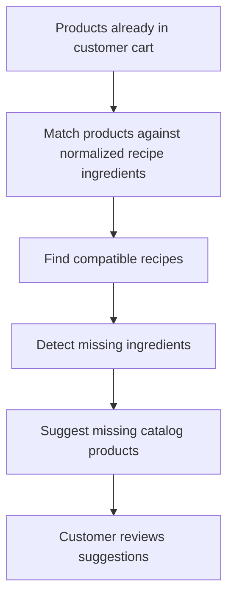
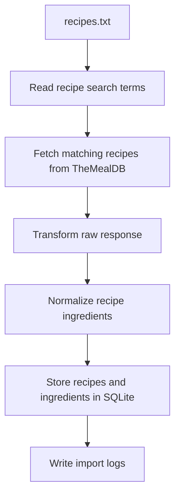

# Product Flow

## Product Vision

A food retailer could use recipe intelligence to help users discover meals they can make from products already in their cart. The importer is the first data preparation step: it collects recipe data, normalizes ingredients, and stores traceable records that can later support recommendations.

## Future Cart-Based Recommendation Flow

In the future product, products already in the customer's cart could be matched against normalized recipe ingredients. The system could then find compatible recipes, detect missing ingredients, and suggest missing products from the catalog.

## Technical Flow For This Challenge

This challenge prepares the data import layer only. It does not include catalog matching, cart creation, frontend screens, or real LLM calls.

## Current Status

The CLI importer is implemented. It reads recipe search terms from `recipes.txt`, calls TheMealDB, transforms meals into normalized recipe data, and stores recipes, ingredients, and import logs in SQLite with Prisma.

Recommendation logic, product catalog matching, frontend screens, embeddings, and real LLM calls remain out of scope.
